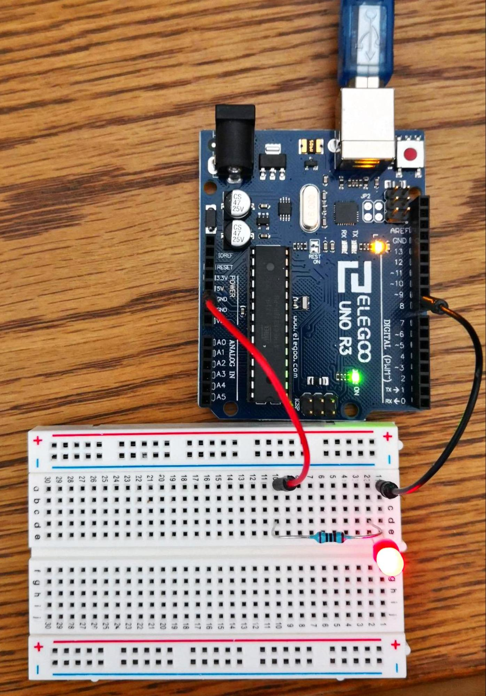

# Arduino for Beginners

If you have never been in touch with electronics nor software development, getting started with an arduino seems hard and comes with quite a steep learning curve. I have found that there are a couple of tutorials out there help you giving a way easier introduction to those topics, but do not provide you with enough context to continue after the tutorials on your own. This series is trying to give you an easy introduction into both arduino and programming, while also opening up topics that should help you progress further and allow you to continue with the arduino.


[TOC]


## Electric Circuits, a refresher


You might remember the basic idea of electricity from school. An electron will travel always from the positive to the negative pole. It's like a highway with a lot of cars traveling in one direction. We call the count of cars in a timespan on the highway current, and their horsepower is equivalent to voltage. So the stronger the cars, the higher the voltage. The more cars, the higher the current.

The fact that there are electron cars on our highway we call power.


## The parts and what they do


### Wires, LEDs, switches and resistors

For our experiments we'll need some cables that are conductors.

LEDs will give us visual feedback if our trials were successful.

Switches we use as circuit breaker. When open, the power cannot flow and the led will be out. If closed, the power will flow and the led will light up. In our first experiment we will use a real button for that, later this switch will be pure software.

And then there are resistors. Why do we need those? Coming back to our highway earlier, imaging that highway is leading over a bridge which only has the capacity for one car at a time or it will collapse. To avoid disaster, a bottleneck road is added before the bridge for security reasons. As our led is not able to hold the full power of the 5 Volt coming out of the arduino, the resistor is doing the same for us. It limits the power of electrons hitting our led. When the power is switched off it will take a blink of an eye before all the remaining electrons will have come through.


### Breadboard

The breadboard is helping us creating a circuit. On both sides there are wires with pins for positive and negative current. We can connect a wire to every hole (called pin) and we will be able to pick up the power.


In between those all lines are wires in the right angle to the outer lines.


### Arduino

The arduino is a microprocessor that we will use both as a power source and the host for the software we will run. We are interested only in two parts of it :


*   The power back, which in the picture you can see as red bar on the top
*   The digital bar which you can see as red bar on the bottom.


## Our first circuit

For the first experiment we will ignore the software part and use only the arduino only as overly sophisticated power source. We use the pin that is labelled 5v as positive pol, the pin labelled gnd is our negative. You can use the pin simply by putting a wire into it.


Let's connect our components.

Put cables into the pins in the arduino and into the Breadboard. We are using the inner connectors directly. Connect the pins in the breadboard with the resistor and the led. Remember, the led's long leg is positive, the short one negative. Only if the positive leg faces the positive current, the led will light up.


If everything is connected correctly, the led will light up. Next we want to add a switch to control the light.

The button that I used is a simple switch that closes the circuit when pressed. It connects the positive input with the resistor.


Now when the button is pressed the light will be lit as the circuit closes, otherwise the circuit is open and the light is off.


## The world of Code

Pressing a button is fun, but tiring. We want the led to blink in a rhythm without our doing. And we want to solve this problem with software.

To do that we enter the world of code.

We will start using the arduino code editor. You can download it here: [https://www.arduino.cc/en/Main/OldSoftwareReleases](https://www.arduino.cc/en/Main/OldSoftwareReleases)

When you open it you will see a screen that looks like the following:


What you can see there are two functions, setup and loop. Functions are methods that you can define, and later call to avoid having to write the same code over and over again. The two functions you see are empty and do nothing for now, but your arduino will need them once the code is running on the chip. The arduino will call the setup function for initializing, and once initialized the loop method will be called over and over again, in an endless loop.

The arduino also has a couple of methods it offers us and that we can use. We will see two of them in a minute.

In addition to functions there are also variables. Variables are little fields that we can use to store values like digits of text fragments, and reuse at different places. We can read their values and even change them.

Arduino comes with some predefined variables we can use, most notably HIGH and LOW. The first one is the equivalent of "with power", the latter for "no power". If we compare this to the button we had before, this we would model as "button is pressed" = HIGH and "button is not pressed" =LOW.

This is already all we need to get us started. Our first program will only consist of two statements. Both statements will call functions that are part of the arduino. The first one is `pinMode`. A function can take in `arguments`, values that the function can then use. This function takes in the number of the pin we will later connect to. We'll just choose the random number 8. The second argument tells the function if this pin will be an INPUT or OUTPUT pin. An INPUT pin can read voltage, an OUTPUT pin can write voltage. We want to write voltage and use it to light up the LED.

Our first statement in the setup method is thus:

```cpp
pinMode(8, OUTPUT);
```

Note that the language we are using is called c. C requires us to use a terminating `;` at the end of each statement.

Arduino knows now we want to use this pin as output, but so far there is no current on this pin. We will have to do so by writing a value. This is done with the function `digitalWrite`. It too takes two arguments, the pin number and what to write. We already heard about the two values we can write, HIGH and LOW. As we want the LED to light up, we use HIGH. This will send some voltage, and light up the led. The pin number will be the same as in the first statement.

The second statement thus looks like this:

```cpp
digitalWrite(8, HIGH);
```

Now both functions have an 8 in them. If we want to switch the pin we would later have to think about changing all the methods that have the 8 in them, which can be error prone. To avoid that, we assign the value of 8 to a variable and use that instead. As I plan to use the red led, I named the variable `red_led`, and used that in the functions.

The final code now should look like the following.


## Running your code on the Arduino

To deploy the code on the arduino connect the USB cable that came with the arduino and click on the upload button. Note that the LED is probably still on if you haven't unplugged the wires, but for the wrong reasons. We want to rewire the arduino now to create a circuit from the digital bar (the lower red bar) to the power bar (the top red bar).


Luckily, this is easy. Just reconnect the wire that is currently on the "5V" pin and plug it into pin 8. Your LED will light up, but this time it's your code that makes it shine.




Such an always-on LED is a bit boring, so next we want to make it blink. To do so, we will have to add another digitalWrite that writes a LOW value. And to do so repeatedly we add it this to the loop function of the arduino file.

Your code would look like the following:

```cpp
void loop() {
	digitalWrite(led_red, HIGH);
	digitalWrite(led_red, LOW);
}
```

Unfortunately, when you run this code the LED will continue to be always on. The reason is that the frequency is so high that behind the resistor for the LED the power will be always on. We will have to insert some breaks to make this possible. Arduino offers us the function `delay`, which takes one argument representing the milliseconds it waits. We will add two 500 milliseconds as delay to get started, the final code should look like the following:


Press on the upload button, and soon your LED should blink just like on this gif:


Lighting up one light is nice, but how about two? If we'd simply add a second led they blink together, but what we really would like is more like the blue lights on emergencies. To accomplish this, we will have to set up two parallel circuits.

_insert pic for parallel circuit schematics_

On our aduino we model that simply by plugging a wire into a second pin, like the one with the number 7. It will be used to control our second, green LED. For the other end we use the breadboards side wires, and take the power we need for our two circuits from there. When done, this should like somewhat like the following:


If we plug in the arduino, only the red led blinks. We will first have to program the other pin to also send in some electrons. First, we create a new variable `led_green`, and assign the value 7 to id, according to our pin. Next we tell arduino that this is another output pin by calling the `pinMode` function with the arguments `led_green` and `OUTPUT` in the `setup` method. In the loop method we duplicate the `writeDigital` and `delay` calls, this time using the `led_green`.

Your final code would look something like this:


When you upload your code and everything is wired correctly, soon your LEDs will blink like the following:


## Reading inputs
### Digital read
As the first project to get input from "outside" the Arduino we want to use the push button to build a light switch. I.e. when we press the button for the first time an LED should turn on, until the button is pressed a second time (and repeat).

To do this, we write a program that triggers a change in the LED state whenever the button is pushed. Therefore we connect the pins like in this schematic:


When the button is not pressed, we read LOW on pin 13, and when the button is pressed we read HIGH. To introduce the value in our program, we can use the `digitalRead()` function whenever we want to grab the value. In our case, we would read the value in each loop iteration. When the button is pressed, i.e. the result of `digitalRead(13)` is HIGH, we want to change the state of the led. To change the LED state, we use `digitalWrite()` as before.

Note however that this will mean that the LED will flicker if you press the button for a longer time. To avoid this, we save the button state at the end of each iteration, and only change the LED if the current state of the button is HIGH, and the previous one is LOW, i.e. direclty after the button was pressed.

The resulting code is:

```
const int led1 = 8;
const int button = 13;

int ledState = LOW;
int lastButtonState = LOW;

void setup() {
  // put your setup code here, to run once:
  pinMode(led1, OUTPUT);
  pinMode(button, INPUT);
  digitalWrite(led1, LOW);
}

void loop() {
  const int buttonState = digitalRead(button);

  if ((buttonState == HIGH) && (lastButtonState == LOW)) {
    ledState = ledState == HIGH ? LOW : HIGH;
    digitalWrite(led1, ledState);
  }

  lastButtonState = buttonState;
}
```

### Analog read
The `digitalRead()` function is fine if we need to read a binary signal, but sensors usually give a range of values depending on the dimension they measure (light, temperature, ...). For processing, the voltage returned by the sensor usually increases if the measured value increases.

To read an analog value, we need to use the analog pins, which are on the other side of the Arduino as the digital pins. To start, we can use the serial output to get a feeling of the returned values. To do this, connect the output of the sensor to the analog pin 1 on the Arduino, and run the following program:

```
void setup() {
  Serial.begin(9600);
}

void loop() {
  int val = analogRead(1);
  Serial.print(val);
  Serial.print('\n');
}
```
When the program runs, open the "Serial Monitor" in the tools menu and change the value of the sensor - see how the numbers printed in the serial monitor change.

To have an idea of how we can use this function, we can have a look at the code of tankie.

### Tankie

Tankie can detect a black line with two sensor input that detect if the color beneath the sensor is black. The two sensors (or two parts of the sensor) are close to each other, so that that the robot is right on the black line if both sides detect black.

If only one side is black, we are about to get off the track, and have to steer to get back to the line. If no side is black, we are lost and have no realistic chance of finding our way again (unless we add other means of navigation).

To model this behavior, we have a `Direction` enum that provides us the four values `LEFT`, `STRAIGHT`, `RIGHT`, `UNKNOWN`.

To decide when we are too far off the black line, we configure a threshold value. The "blacker" the detected color of each sensor is, the lower is the value of the sensor output. So, if a sensor output value is below the threshold, it is "good", otherwise we have to steer to get back to the black line.

This leads us to the following code:

```
enum Direction {
  LEFT,
  STRAIGHT,
  RIGHT,
  UNKNOWN
};

Direction getDirectionForValues(int rightValue, int leftValue){
  bool leftOnBlack = leftValue < threshold;
  bool rightOnBlack = rightValue < threshold;

  if (leftOnBlack && rightOnBlack) {
    return STRAIGHT;
  }
  if (leftOnBlack) {
    return LEFT;
  }
  if (rightOnBlack) {
    return RIGHT;
  }
  return STRAIGHT;
}
```

We can connect the sensor module to the Arduino. Note that the sensor has two connections, bound in two pairs:

* Red for 5V input
* Red/green for GND
* Blue for the left input
* Blue/Yellow for the right input

The blue and blue/yellow connections have to be connected to analog input ports. If we use A0 for the right input and A1 for the black one, it should look like this:


(Note that the sensor actually looks different)

Read the values and forward the read values to the `getDirectionForValues()` function.

Then try to print the direction values using the serial monitor as above.

Then, you can start writing the logic for the robot...

## Going further - Advanced topics


### Modularization


### Branches, loops and recursion.


### Testing


### No delays


<!-- GD2md-html version 1.0β11 -->
